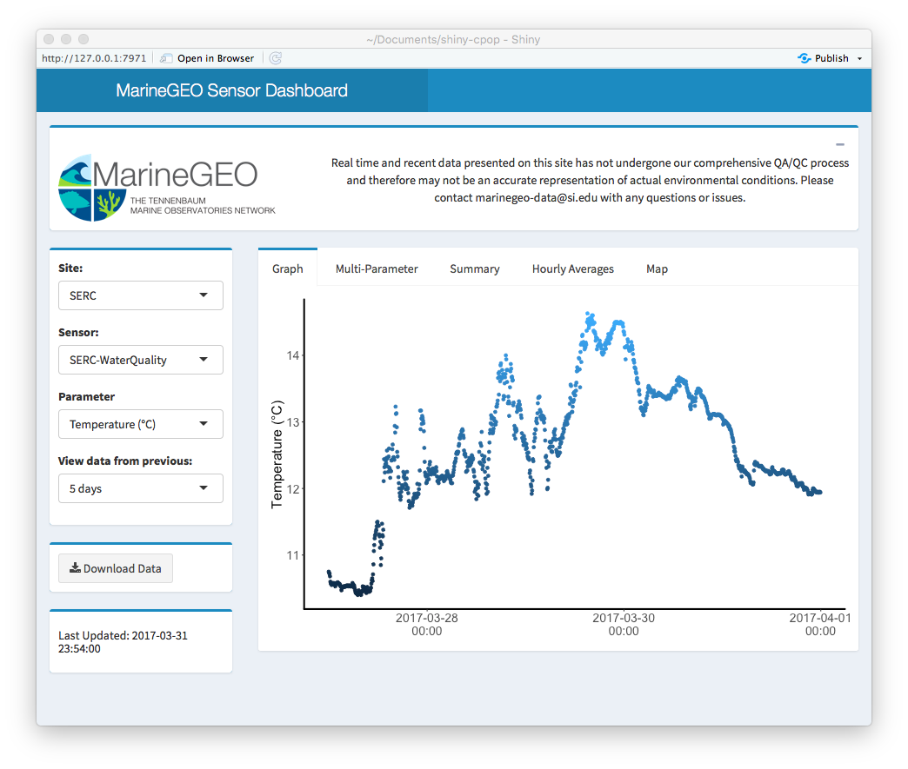

# shiny-cpop
MarineGEO CPOP data visualization using R Shiny & Dropbox




## About

R Shiny application to provide visualization of TMON sensor data in near-real time. Datasets need to be csv files that are regularly updated and available online. Datasets can be hosted on Dropbox by sharing the file to the public. 

## Setup

Sensor files need to be available at a public URL and updated regularly. Public files on dropbox is the prefered method for hosting data. All dataset configuration should be done in the `dataSource.R` file. 


### Configuring `dataSource.R`

#### Unit Labels (optional)

Each sensor parameter can have custom labels for the units defined. For each unique sensor type provide a crosswalk as a named list with the parameter column name and the desired units to display.

```r
waterquality.labels <- c("Temperature"="Temperature (°C)", 
           "Specific.Conductivity"="Specific Conductivity (mS/cm)",
           "Conductivity"= "Conductivity (mS/cm)",
           "Salinity"= "Salinity (psu)",
           "Dissolved.Oxygen"= "DO (%)",
           "Dissolved.Oxygen.2"= "DO (mg/l)",
           "Pressure"= "Pressure (psi)",
           "Depth"= "Depth (meters)",
           "Turbidity"= "Turbidity (FNU)",
           "Chlorophyll"= "Chlorophyll (RFU)",
           "Chlorophyll.2"= "Chlorophyll (µg/l)",
           "BGA.PE"= "BGA-PE (RFU)",
           "BGA.PE.2"= "BGA-PE (µg/l)",
           "FDOM"= "FDOM (RFU)",
           "FDOM.2"= "FDOM (ppb QSE)",
           "Battery"= "Battery (Volts)")
```

####  Sensor Dataframe (required)

All of the dataset configuration is saved as a R dataframe object that is loaded when the shiny app starts up. The dataframe should contain one row for each dataset. The dataframe should contain info about the `site`, `sensorName`, `type`, `urlpath`, `ignore`, `na`, `units`, and `coordinates`.

 - `site`: string containing the site abbreviation. This will populate the site dropdown.
 - `type`: string describing the data set type. This will be used to populate the sensor dropdown.
 - `urlpath`: full url to the dataset. If hosting on dropbox, makesure it is url of the raw data not the dropbox page.
 - `ignore`: vector of columns to ignore for the parameter dropdown - ex: `c("Timestamp", "Site", "Bat")`
 - `na`: vector of values to use for nulls - ex: `c("", "NA")`
 - `units`: named list of column names and labelled units
 - `coordinates`: vector of coordinates for the site (latitude, longitude) - ex:`c(38.886179, -76.541424)`
 
 
#### Dropbox raw url
 
 To get the raw data from dropbox, rather than the page use `https://dl.dropboxusercontent.com/s/` + dropbox id and filename + `?dl=0`
